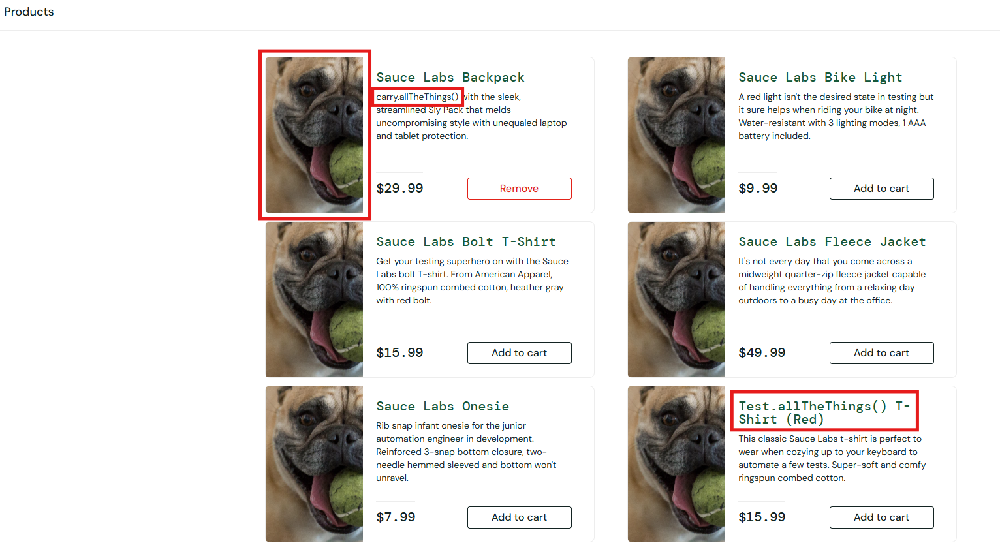
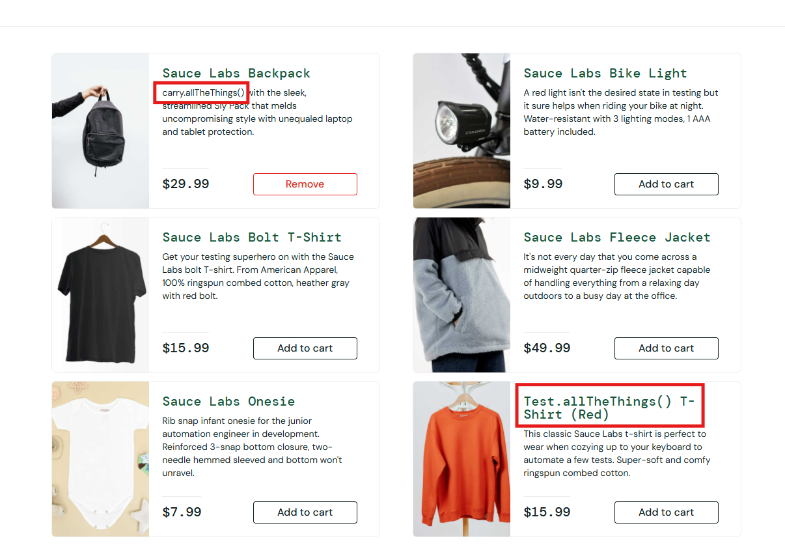
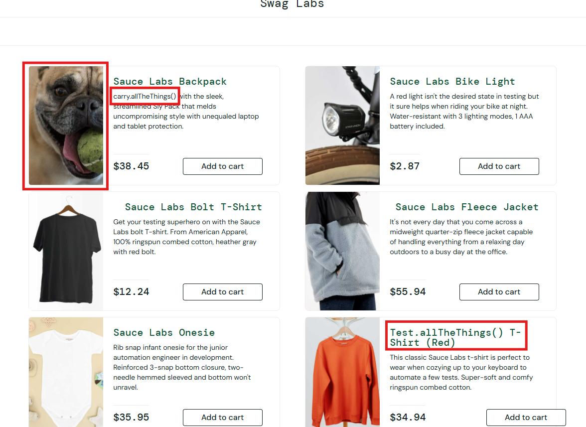
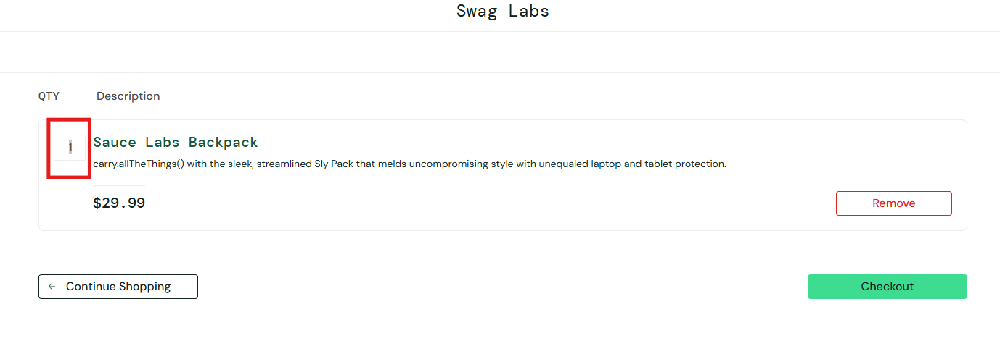
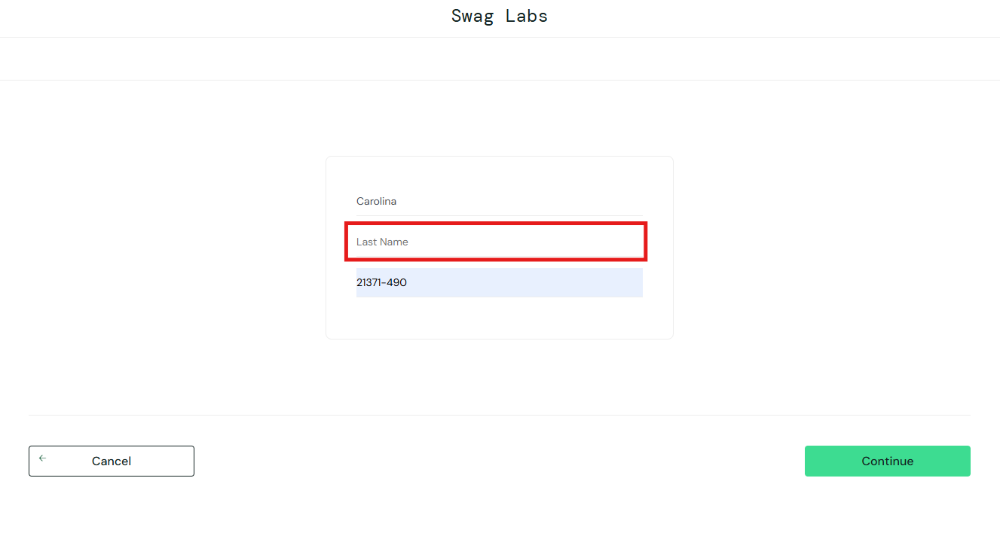
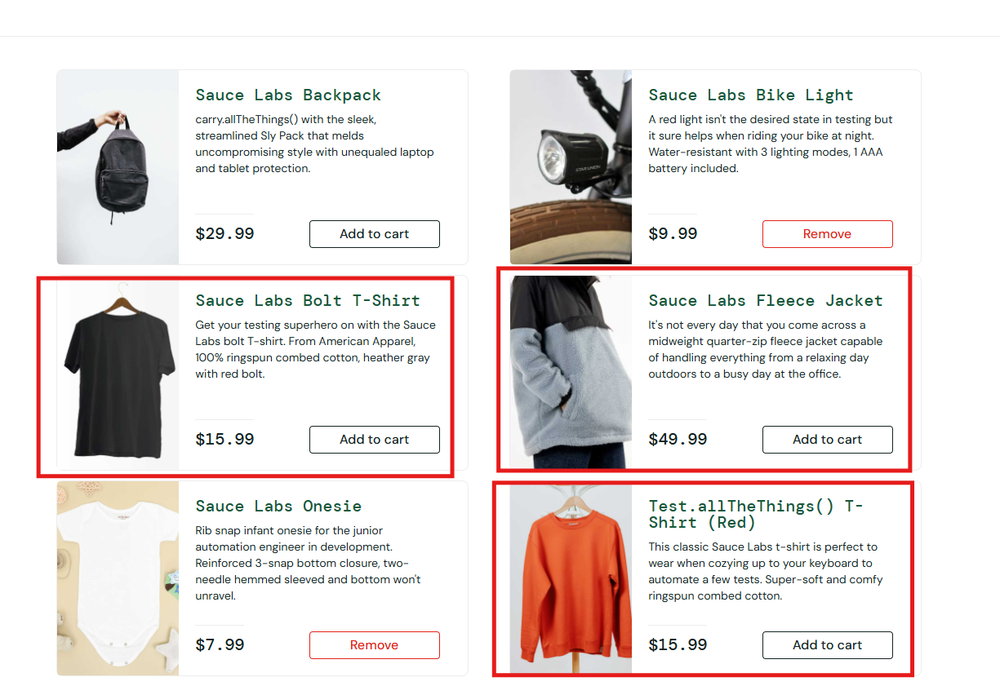
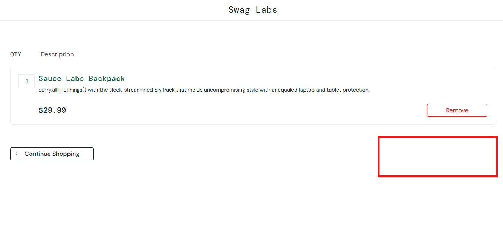
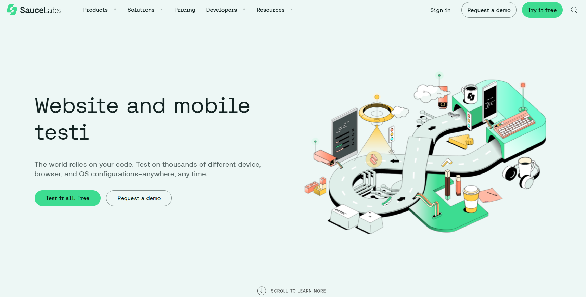
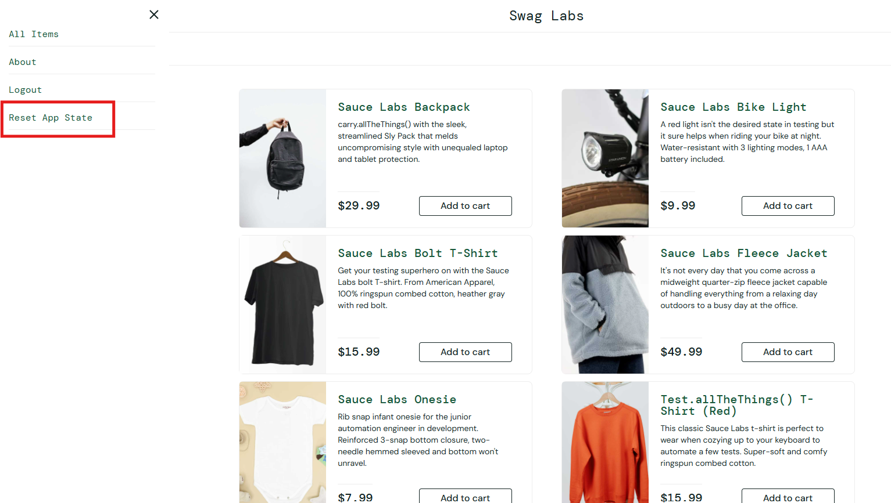

# soucedemo-betalent
# Plano de Testes - Sauce Demo

**Objetivo:** Validar as funcionalidades e a experiência de usuário da plataforma de e-commerce Sauce Demo.

---

## 1.2.1 Cenários de Teste Login

### Caso de Teste 1.2.1.1

**Descrição:** Login com usuário padrão (`standard_user`)  
**Pré-condição:** Nenhuma  

**Procedimento:**
1. Acesse a URL: [https://www.saucedemo.com](https://www.saucedemo.com)
2. Insira o usuário: `standard_user`
3. Insira a senha: `secret_sauce`
4. Clique no botão "Login"

**Resultado Esperado:**  
O usuário deve ser redirecionado para a página de produtos.

**Resultado Obtido:**  
O usuário é redirecionado para a página de produtos.

**Evidência do Bug:**  
N/A

---

### Caso de Teste 1.2.1.2

**Descrição:** Login com usuário bloqueado (`locked_out_user`)  
**Pré-condição:** Nenhuma  

**Procedimento:**
1. Acesse a URL: [https://www.saucedemo.com](https://www.saucedemo.com)
2. Insira o usuário: `locked_out_user`
3. Insira a senha: `secret_sauce`
4. Clique no botão "Login"

**Resultado Esperado:**  
O usuário deve ter bloqueio de acesso e a mensagem:  
*"Epic sadface: Sorry, this user has been locked out"*.

**Resultado Obtido:**  
A mensagem:  
*"Epic sadface: Sorry, this user has been locked out"* é exibida.

**Evidência do Bug:**  
N/A

---

### Caso de Teste 1.2.1.3

**Descrição:** Login com usuário problemático (`problem_user`)  
**Pré-condição:** Nenhuma  

**Procedimento:**
1. Acesse a URL: [https://www.saucedemo.com](https://www.saucedemo.com)
2. Insira o usuário: `problem_user`
3. Insira a senha: `secret_sauce`
4. Clique no botão "Login"

**Resultado Esperado:**  
O usuário deve ser redirecionado para a página de produtos.

**Resultado Obtido:**  
O usuário é redirecionado para a página de produtos. No entanto:  
- A listagem de produtos aparece com erro, exibindo a imagem de um cachorro em todos os produtos.  
- Todas as descrições dos produtos apresentam erro.  

**Evidência do Bug:**  

---

### Caso de Teste 1.2.1.4

**Descrição:** Login com usuário de performance baixa (`performance_glitch_user`)  
**Pré-condição:** Nenhuma  

**Procedimento:**
1. Acesse a URL: [https://www.saucedemo.com](https://www.saucedemo.com)
2. Insira o usuário: `performance_glitch_user`
3. Insira a senha: `secret_sauce`
4. Clique no botão "Login"

**Resultado Esperado:**  
O usuário deve ser redirecionado para a página de produtos.

**Resultado Obtido:**  
O usuário é redirecionado para a página de produtos. No entanto:  
- O tempo de espera para acessar a página é maior que o normal.  
- Algumas descrições e títulos da listagem de produtos apresentam erro.  

**Evidência do Bug:**  

---

### Caso de Teste 1.2.1.5

**Descrição:** Login com usuário com erro (`error_user`)  
**Pré-condição:** Nenhuma  

**Procedimento:**
1. Acesse a URL: [https://www.saucedemo.com](https://www.saucedemo.com)
2. Insira o usuário: `error_user`
3. Insira a senha: `secret_sauce`
4. Clique no botão "Login"

**Resultado Esperado:**  
O usuário deve ser redirecionado para a página de produtos.

**Resultado Obtido:**  
O usuário é redirecionado para a página de produtos. No entanto:  
- Algumas descrições e títulos da listagem de produtos apresentam erro.  

**Evidência do Bug:**  

---

### Caso de Teste 1.2.1.6

**Descrição:** Login com usuário visual (`visual_user`)  
**Pré-condição:** Nenhuma  

**Procedimento:**
1. Acesse a URL: [https://www.saucedemo.com](https://www.saucedemo.com)
2. Insira o usuário: `visual_user`
3. Insira a senha: `secret_sauce`
4. Clique no botão "Login"

**Resultado Esperado:**  
O usuário deve ser redirecionado para a página de produtos.

**Resultado Obtido:**  
O usuário é redirecionado para a página de produtos. No entanto:  
- A listagem de produtos apresenta erro.  
- Um dos produtos exibe a imagem de um cachorro.  
- Outro produto tem o nome e a descrição exibidos incorretamente.  

**Evidência do Bug:**  

---

## 1.2.2 Cenário de Ordenação e Filtragem de Produtos

**Descrição:** Realizar ordenação e filtragem de todos os produtos listados com todas as opções disponíveis.

---

### Caso de Teste 1.2.2.1

**Descrição:** Ordenar os produtos por ordem alfabética (A até Z).  
**Pré-condição:** Estar logado na plataforma com `standard_user`.

**Procedimento:**
1. Acesse a página de produtos.
2. No dropdown de ordenação, selecione "Name (A to Z)".

**Resultado Esperado:**  
A listagem de produtos deve ser ordenada por ordem alfabética (A até Z).

**Resultado Obtido:**  
A listagem de produtos foi ordenada por ordem alfabética (A até Z).

**Evidência do Bug:**  
N/A

---

### Caso de Teste 1.2.2.2

**Descrição:** Ordenar os produtos por ordem alfabética (Z até A).  
**Pré-condição:** Estar logado na plataforma com `standard_user`.

**Procedimento:**
1. Acesse a página de produtos.
2. No dropdown de ordenação, selecione "Name (Z to A)".

**Resultado Esperado:**  
Os produtos devem ser ordenados corretamente por ordem alfabética (Z até A).

**Resultado Obtido:**  
Os produtos foram ordenados corretamente por ordem alfabética (Z até A).

**Evidência do Bug:**  
N/A

---

### Caso de Teste 1.2.2.3

**Descrição:** Ordenar os produtos por preço (menor para maior).  
**Pré-condição:** Estar logado na plataforma com `standard_user`.

**Procedimento:**
1. Acesse a página de produtos.
2. No dropdown de ordenação, selecione "Price (low to high)".

**Resultado Esperado:**  
Os produtos devem ser ordenados corretamente do menor para o maior preço.

**Resultado Obtido:**  
Os produtos foram ordenados corretamente do menor para o maior preço.

**Evidência do Bug:**  
N/A

---

### Caso de Teste 1.2.2.4

**Descrição:** Ordenar os produtos por preço (maior para menor).  
**Pré-condição:** Estar logado na plataforma com `standard_user`.

**Procedimento:**
1. Acesse a página de produtos.
2. No dropdown de ordenação, selecione "Price (high to low)".

**Resultado Esperado:**  
Os produtos devem ser ordenados corretamente do maior para o menor preço.

**Resultado Obtido:**  
Os produtos foram ordenados corretamente do maior para o menor preço.

**Evidência do Bug:**  
N/A

---

## 1.2.3 Cenário de Fluxo Completo de Compra

**Descrição:** Realizar o fluxo de compra de um ou mais produtos até a finalização do pedido.

---

### Caso de Teste 1.2.3.1

**Descrição:** Inserir um ou mais produtos no carrinho e realizar uma compra com sucesso.  
**Pré-condição:** Estar logado na plataforma com `standard_user`.

**Procedimento:**
1. Adicione produtos ao carrinho.
2. Clique no ícone de carrinho e vá para a página do carrinho.
3. Clique em "Checkout".
4. Insira as informações de entrega (nome, endereço, etc.).
5. Confira todas as informações de pagamento e entrega e finalize a compra.

**Resultado Esperado:**  
A mensagem:  
*"Thank you for your order! Your order has been dispatched, and will arrive just as fast as the pony can get there!"*  
deverá ser exibida.

**Resultado Obtido:**  
A compra foi finalizada e a mensagem foi exibida corretamente.

**Evidência do Bug:**  
N/A

---

### Caso de Teste 1.2.3.2

**Descrição:** Inserir um produto no carrinho, aumentar sua quantidade e finalizar a compra com `standard_user`.  
**Pré-condição:** Estar logado na plataforma.

**Procedimento:**
1. Adicione produtos ao carrinho.
2. Clique no ícone de carrinho e vá para a página do carrinho.
3. Aumente a quantidade do produto na caixinha.
4. Clique em "Checkout".
5. Insira as informações de entrega (nome, endereço, etc.).
6. Confira todas as informações de pagamento e entrega e finalize a compra.

**Resultado Esperado:**  
A mensagem:  
*"Thank you for your order! Your order has been dispatched, and will arrive just as fast as the pony can get there!"*  
deverá ser exibida.

**Resultado Obtido:**  
Não foi possível aumentar a quantidade de itens, pois a caixinha onde se encontra a informação não está permitindo a edição. Com isso, não foi possível finalizar a compra com mais de um item do mesmo produto.

**Evidência do Bug:**  

---

### Caso de Teste 1.2.3.2

**Descrição:** Inserir um ou mais produtos no carrinho e realizar uma compra com sucesso.  
**Pré-condição:** Estar logado na plataforma com `problem_user`.

**Procedimento:**
1. Adicione produtos ao carrinho.
2. Clique no ícone de carrinho e vá para a página do carrinho.
3. Clique em "Checkout".
4. Insira as informações de entrega (nome, endereço, etc.).
5. Confira todas as informações de pagamento e entrega e finalize a compra.

**Resultado Esperado:**  
A mensagem:  
*"Thank you for your order! Your order has been dispatched, and will arrive just as fast as the pony can get there!"*  
deverá ser exibida.

**Resultado Obtido:**  
A compra não foi concluída pois na tela de preenchimento de "Checkout: Your Information" não foi possível preencher o 
campo "last name", quando clicamos para preenher o ponteiro sobe para o campo "first name" automaticamente.

**Evidência do Bug:**  

---

### Caso de Teste 1.2.3.3

**Descrição:** Inserir um ou mais produtos no carrinho e realizar uma compra com sucesso.  
**Pré-condição:** Estar logado na plataforma com `performance_glitch_user`.

**Procedimento:**
1. Adicione produtos ao carrinho.
2. Clique no ícone de carrinho e vá para a página do carrinho.
3. Clique em "Checkout".
4. Insira as informações de entrega (nome, endereço, etc.).
5. Confira todas as informações de pagamento e entrega e finalize a compra.

**Resultado Esperado:**  
A mensagem:  
*"Thank you for your order! Your order has been dispatched, and will arrive just as fast as the pony can get there!"*  
deverá ser exibida.

**Resultado Obtido:**  
A compra foi concluída com sucesso, porém, foi observado que a plataforma está demorando um tempo acima do normal para responder as ações e navegação entre páginas.

**Evidência do Bug:**  
N/A

---

### Caso de Teste 1.2.3.4

**Descrição:** Inserir um ou mais produtos no carrinho e realizar uma compra com sucesso.  
**Pré-condição:** Estar logado na plataforma com `error_user`.

**Procedimento:**
1. Adicione produtos ao carrinho.
2. Clique no ícone de carrinho e vá para a página do carrinho.
3. Clique em "Checkout".
4. Insira as informações de entrega (nome, endereço, etc.).
5. Confira todas as informações de pagamento e entrega e finalize a compra.

**Resultado Esperado:**  
A mensagem:  
*"Thank you for your order! Your order has been dispatched, and will arrive just as fast as the pony can get there!"*  
deverá ser exibida.

**Resultado Obtido:**  
Foi observado que os produtos que estão selecionados na evidencia abaixo, apresentaram problema no momento da seleção para inserir no carrinho. No momento que clicamos em "Add o cart" ele não insere o produto no carrinho, e não apresenta erro em tela.
Os demais produtos não apresentaram erro no momento da inclusão no carrinho e foi possível concluir a compra com sucesso.

**Evidência do Bug:**  

---

### Caso de Teste 1.2.3.5

**Descrição:** Inserir um ou mais produtos no carrinho e realizar uma compra com sucesso.  
**Pré-condição:** Estar logado na plataforma com `visual_user`.

**Procedimento:**
1. Adicione produtos ao carrinho.
2. Clique no ícone de carrinho e vá para a página do carrinho.
3. Clique em "Checkout".
4. Insira as informações de entrega (nome, endereço, etc.).
5. Confira todas as informações de pagamento e entrega e finalize a compra.

**Resultado Esperado:**  
A mensagem:  
*"Thank you for your order! Your order has been dispatched, and will arrive just as fast as the pony can get there!"*  
deverá ser exibida.

**Resultado Obtido:**  
Não foi possível concluir a compra pois na tela de checkout o botão de "Checkout" não aparece para prosseguir com o processo de compra.

**Evidência do Bug:**  

---

## 1.2.4 Cenário - Remoção de Itens do Carrinho

**Descrição:** Validar a remoção de um ou mais produtos do carrinho com sucesso.

### Caso de Teste 1.2.4.1

**Descrição:** Remover um ou mais produtos do carrinho.  
**Pré-condição:** Estar logado na plataforma com `standard_user`.

**Procedimento:**
1. Adicione produtos ao carrinho.
2. Acesse o carrinho.
3. Clique no ícone de "X" ao lado de um produto para removê-lo.

**Resultado Esperado:**  
O produto deve ser removido do carrinho.

**Resultado Obtido:**  
O produto foi removido do carrinho com sucesso.

**Evidência do Bug:**  
N/A

---

## 1.2.5 Cenário - Navegar entre as Páginas

**Descrição:** Testar a navegação entre as páginas do site, garantindo que as opções sejam acessíveis e funcionais.

---

### Caso de Teste 1.2.5.1

**Descrição:** Realizar navegação entre as opções do menu.  
**Pré-condição:** Estar logado na plataforma com `standard_user`.

**Procedimento:**
1. Acesse a página inicial.
2. Clique no menu lateral.
3. Navegue pelas opções do menu clicando em uma por uma.

**Resultado Esperado:**  
As páginas do menu devem abrir com sucesso, e deve ser possível retornar à Home.

**Resultado Obtido:**  
- Ao clicar em "All Items", a página permanece na listagem de produtos aberta.
- Ao clicar em "About", o site redireciona para outro domínio sem opção de retorno ao e-commerce.
- Ao clicar em "Logout", o usuário é redirecionado para a tela de login.
- Ao clicar em "Reset App State", nenhuma ação ocorre; o usuário permanece na tela de produtos.

**Evidência do Bug:**  
- Menu "About" redireciona para outro site sem opção de retorno.  

- "Reset App State" não apresenta funcionalidade.

---

### Caso de Teste 1.2.5.2

**Descrição:** Realizar navegação entre os produtos listados.  
**Pré-condição:** Estar logado na plataforma com `standard_user`.

**Procedimento:**
1. Acesse a página inicial.
2. Navegue pelos produtos da listagem.

**Resultado Esperado:**  
Os produtos devem abrir corretamente, e deve ser possível retornar à Home através da opção “Back to Products”.

**Resultado Obtido:**  
Os produtos abriram com sucesso, e o retorno à Home pela opção “Back to Products” foi funcional.

**Evidência do Bug:**  
N/A

---

## 1.3.2 Cenário - Testes de Responsividade

**Descrição:** Avaliar a responsividade do site em dispositivos móveis.

---

### Caso de Teste 1.3.2.1.1

**Descrição:** Acessar o site em dispositivos móveis ou simular a exibição via ferramentas de inspeção.  
**Pré-condição:** Estar logado na plataforma com `standard_user`.

**Procedimento:**
1. Simular acesso via celular.
2. Navegar pelas páginas e testar elementos interativos, como botões e menus.

**Resultado Esperado:**  
O site deve se ajustar adequadamente à tela do dispositivo, mantendo funcionalidade e clareza.

**Resultado Obtido:**  
O site se ajustou corretamente, preservando funcionalidade e clareza.

**Evidência do Bug:**  
N/A

---

## 1.3.2 Cenário - Testes de Usabilidade

**Descrição:** Verificar aspectos importantes de usabilidade para oferecer uma experiência agradável e inclusiva.

---

### Caso de Teste 1.3.2.2.1

**Descrição:** Mensagem de confirmação de item adicionado ao carrinho.  
**Pré-condição:** Estar logado na plataforma com `standard_user`.

**Procedimento:**
1. Selecionar um produto clicando no botão "Add to Cart".
2. Observar o feedback visual e textual após a ação.

**Resultado Esperado:**  
O ícone do carrinho deve exibir o número atualizado de itens, acompanhado por uma mensagem confirmando a adição do item.

**Resultado Obtido:**  
O ícone do carrinho atualiza o número de itens, mas não há mensagem de feedback.

**Evidência do Bug:**  
Ausência de mensagem de feedback ao adicionar item.

---

### Caso de Teste 1.3.2.2.2

**Descrição:** Mensagem ao tentar login com campos vazios.  
**Pré-condição:** Estar na página de login.

**Procedimento:**
1. Clicar no botão "Login" sem preencher nenhum campo.

**Resultado Esperado:**  
Uma mensagem clara deve informar que os campos são obrigatórios.

**Resultado Obtido:**  
A mensagem exibida foi:  
*"Epic sadface: Username is required."*

**Evidência do Bug:**  
N/A

---

### Caso de Teste 1.3.2.2.3

**Descrição:** Mensagem ao inserir credenciais inválidas.  
**Pré-condição:** Estar na página de login.

**Procedimento:**
1. Inserir um nome de usuário ou senha incorreta.
2. Clicar no botão "Login".

**Resultado Esperado:**  
Uma mensagem de erro específica deve orientar o usuário a verificar suas credenciais.

**Resultado Obtido:**  
A mensagem exibida foi:  
*"Epic sadface: Username and password do not match any user in this service."*

**Evidência do Bug:**  
N/A

---

### Caso de Teste 1.3.2.2.4

**Descrição:** Testar o botão "Cancelar" na tela de checkout.  
**Pré-condição:** Estar logado na plataforma com `standard_user`.

**Procedimento:**
1. Clicar no botão "Cancel" na tela de checkout.

**Resultado Esperado:**  
O botão deve redirecionar para o carrinho com uma nomenclatura mais intuitiva, como "Voltar ao Carrinho".

**Resultado Obtido:**  
O botão redirecionou para o carrinho, mas a nomenclatura gera desconfiança no processo. Uma nomenclatura como "Voltar ao Carrinho" seria mais intuitiva.

**Evidência do Bug:**  
Botão "Cancel" não transmite clareza de ação.

# Sugestões de Melhoria de UX/UI

## Melhoria 1: Implementar uma tela de cadastro para criação de contas
Atualmente, o site não oferece uma opção para que os usuários criem suas próprias contas diretamente. Essa funcionalidade é essencial para um e-commerce, pois permite que novos usuários se cadastrem e comecem a navegar ou realizar compras imediatamente.

### Impacto positivo
- **Aumento no número de usuários cadastrados:** Sem a necessidade de um cadastro prévio, o site pode estar limitando o alcance a apenas usuários predefinidos. A inclusão dessa funcionalidade pode atrair novos clientes.
- **Melhoria na experiência do usuário (UX):** Tornar o processo de registro simples e acessível diminui barreiras para a entrada de novos consumidores.
- **Possibilidade de personalização:** Com contas personalizadas, é possível oferecer recomendações baseadas no histórico de navegação e compras, aumentando as chances de conversão.
- **Fidelização:** Usuários com contas próprias têm maior probabilidade de retornar ao site, especialmente se houver funcionalidades como "favoritos" ou histórico de pedidos associados ao perfil.

---

## Melhoria 2: Adicionar a opção de "Restaurar senha" na tela de login
A falta de uma funcionalidade para restaurar senhas pode causar frustração nos usuários que, porventura, esqueçam suas credenciais. Atualmente, esses usuários podem ficar impedidos de acessar a plataforma.

### Impacto positivo
- **Redução de abandono:** Sem uma opção de recuperação de senha, usuários que não conseguem acessar suas contas podem desistir de concluir compras, resultando em perda de receita.
- **Melhoria na retenção de clientes:** Prover um mecanismo rápido e seguro para restaurar senhas reduz a probabilidade de que os usuários abandonem o site em busca de alternativas.
- **Fortalecimento da confiança:** Ao oferecer métodos seguros para recuperação de contas, como envio de e-mails ou autenticação em dois fatores, o site transmite maior credibilidade e segurança aos seus clientes.
- **Fluxo contínuo de navegação:** Facilitar o acesso ao site aumenta as chances de conversão, uma vez que elimina fricções que podem afastar os clientes durante o processo de login.

---

## Melhoria 3: Melhorar a responsividade em dispositivos móveis
Atualmente, o site não oferece a melhor experiência para usuários que acessam a plataforma por smartphones ou tablets, o que pode impactar negativamente a navegação e o processo de compra.

### Impacto positivo
- **Aumento nas conversões mobile:** Com a crescente utilização de dispositivos móveis para compras online, oferecer uma experiência otimizada pode aumentar significativamente as vendas.
- **Melhoria na experiência do usuário (UX):** Interfaces ajustadas para diferentes tamanhos de tela tornam a navegação mais intuitiva e reduzem a frustração.
- **SEO e visibilidade:** Sites responsivos são priorizados por mecanismos de busca como o Google, o que pode melhorar a classificação nos resultados de pesquisa e atrair mais visitantes.
- **Competitividade:** Um site responsivo atende às expectativas modernas dos consumidores e fortalece a posição da marca em um mercado competitivo.

---

## Melhoria 4: Incluir validações mais robustas no fluxo de checkout
O fluxo de checkout é uma das etapas mais críticas do processo de compra. Validações mais robustas garantem que dados essenciais, como endereço e informações de pagamento, sejam preenchidos corretamente, minimizando erros e interrupções.

### Impacto positivo
- **Redução de carrinhos abandonados:** Erros no preenchimento de formulários ou a falta de validação clara podem levar usuários a abandonar o processo de compra.
- **Aumento na segurança:** Validar informações como cartões de crédito e endereços para diminuir fraudes e erros operacionais.
- **Melhoria na experiência:** Validações em tempo real (como destacar campos obrigatórios ou informar formatos corretos) tornam o processo de compra mais fluido e eficiente.
- **Confiança do cliente:** Um checkout que funciona de forma consistente e segura reforça a credibilidade da marca.

---

## Melhoria 5: Oferecer mensagens de erro detalhadas e com soluções claras
Atualmente, as mensagens de erro podem ser genéricas ou pouco informativas, o que dificulta para os usuários entenderem e corrigirem problemas.

### Impacto positivo
- **Redução de frustração:** Mensagens claras ajudam o usuário a corrigir problemas de forma rápida e independente, evitando abandono.
- **Melhoria na experiência do cliente:** Indicar exatamente o que deu errado (ex.: "CEP inválido, insira um código de 8 dígitos") facilita a navegação e aumenta a satisfação.
- **Suporte mais eficiente:** Mensagens específicas reduzem a necessidade de contato com o suporte, liberando recursos internos para outras demandas.
- **Aumento na conversão:** Orientar o usuário a resolver erros com soluções simples mantém o fluxo de compra ativo, reduzindo desistências.

---

## Melhoria 6: Alterar o rótulo do botão "Cancelar" na tela de checkout para "Voltar"
Atualmente, o botão "Cancelar" na tela de checkout executa a ação de "Voltar", o que pode causar confusão e insegurança nos usuários. Eles podem interpretar que clicar em "Cancelar" resultará na perda dos itens do carrinho ou das informações preenchidas até o momento.

### Impacto positivo
- **Redução de frustração:** Um botão com nomenclatura clara, como "Voltar", evita mal-entendidos, garantindo que o usuário compreenda exatamente a função da ação e navegue com mais segurança.
- **Melhoria na experiência do cliente:** Um rótulo mais intuitivo alinha-se às expectativas do usuário e reduz a ansiedade, promovendo uma experiência de compra mais tranquila e confiável.
- **Redução na taxa de abandono:** A clareza no fluxo de checkout incentiva o usuário a concluir a compra, diminuindo o risco de desistências por medo de perder informações ou progresso.
- **Fortalecimento da confiança:** Essa melhoria demonstra cuidado com os detalhes e preocupação com a experiência do cliente, aumentando a percepção de profissionalismo da plataforma.

---

## Melhoria 7: Adicionar feedback visual e textual para ações e garantir texto alternativo em imagens
Atualmente, ao adicionar um item ao carrinho, o único feedback é a mudança da cor do ícone do carrinho para vermelho. Não há uma notificação clara informando que a ação foi concluída. Além disso, as imagens do site carecem de texto alternativo, comprometendo a acessibilidade.

### Impacto positivo
- **Aumento da clareza para os usuários:** Um feedback visual (como um pop-up ou mensagem de confirmação "Item adicionado ao carrinho!") reduz a incerteza do cliente sobre se a ação foi bem-sucedida.
- **Melhoria na experiência do cliente:** O feedback textual e visual promove confiança e facilita a navegação, especialmente em sites de e-commerce onde ações rápidas e claras são essenciais.
- **Maior acessibilidade:** Incluir texto alternativo nas imagens permite que usuários com deficiência visual ou que utilizam leitores de tela naveguem e entendam o conteúdo do site, tornando a plataforma mais inclusiva.
- **Redução de erros:** Mensagens de feedback claras diminuem a chance de o usuário realizar ações redundantes, como adicionar o mesmo item várias vezes ao carrinho por falta de confirmação.
- **Melhoria na conversão:** Uma experiência mais interativa e acessível mantém os usuários engajados, reduzindo a taxa de abandono e incentivando compras adicionais.

---

## Melhoria 8: Implementar filtros por categorias, avaliações e outras características relevantes
Atualmente, o site não oferece essas opções de filtros, o que pode dificultar a navegação dos usuários em um catálogo amplo de produtos.

### Impacto positivo
- **Agilidade na busca:** Permitir que os usuários refinem sua pesquisa por critérios específicos reduz o tempo necessário para encontrar produtos de interesse.
- **Melhoria na experiência do cliente:** Filtros intuitivos tornam a navegação mais agradável, aumentando a probabilidade de o cliente explorar o catálogo completo.
- **Aumento da conversão:** Facilitar a localização de produtos alinhados às preferências do usuário pode resultar em um maior número de compras realizadas.
- **Diferenciação competitiva:** Um sistema de filtros eficiente agrega valor ao e-commerce, destacando-o em relação a concorrentes com sistemas de busca menos avançados.

# Riscos Identificados

## Risco 1: Ausência de filtros de categoria
**Descrição:**  
A falta de filtros para categorias específicas de produtos pode levar o usuário a ter dificuldade em encontrar itens desejados, especialmente em um catálogo extenso.

**Impacto:**  
- Experiência do usuário comprometida, aumentando a frustração.  
- Tempo de navegação elevado, o que pode levar ao abandono do site.  
- Redução nas conversões, pois os usuários podem desistir de realizar compras.  

**Solução sugerida:**  
Implementar filtros por categorias, avaliações e outras características relevantes para agilizar e facilitar a busca.

---

## Risco 2: Falta de validação de campos obrigatórios no checkout
**Descrição:**  
A ausência de validações claras para campos obrigatórios no fluxo de checkout pode permitir erros de preenchimento ou submissão incompleta.

**Impacto:**  
- Frustração do cliente ao perceber problemas somente nas etapas finais.  
- Possível aumento no abandono de carrinho devido à demora ou complexidade para corrigir erros.  
- Risco de dados incorretos comprometerem o processamento de pedidos, como entregas em endereços errados.  

**Solução sugerida:**  
Adicionar validações em tempo real e mensagens de erro específicas, destacando os campos que precisam ser corrigidos.

---

## Risco 3: Ausência de opção para visualizar a senha na tela de login
**Descrição:**  
A falta de uma funcionalidade que permita visualizar a senha digitada pode levar a erros de digitação e aumentar a frustração do usuário.

**Impacto:**  
- **Erros de login:** Usuários podem inserir a senha incorretamente sem perceber, resultando em falhas repetidas ao tentar acessar a conta.  
- **Experiência negativa:** A necessidade de tentar várias vezes ou redefinir a senha pode levar à insatisfação e, em alguns casos, ao abandono da plataforma.  
- **Sobrecarga no suporte:** Pedidos de recuperação de senha desnecessários podem sobrecarregar o suporte, demandando mais recursos para atender aos clientes.  

**Solução sugerida:**  
Implementar um botão ou ícone de "mostrar/ocultar senha" no campo de login, permitindo que o usuário visualize a senha digitada antes de submetê-la. Essa funcionalidade deve estar disponível em todas as interfaces do site, garantindo uma experiência consistente e acessível.

**Autor:** Carolina Magalhaes Etcheverria  
**Data:** 26/11/2024

